# RSS Keyword SNS Notifier

RSS フィードに指定したキーワードが含まれる記事が配信されたとき、SNS に通知する仕組み。 
`.env` ファイルに RSS フィード、キーワードを記述し、Lambda で定期実行することで実現。 
定期実行時間の変更も可能 (デフォルトは1時間)。

## Architecture
EventBridge で Lambda 関数を定期実行して RSS フィードを取得し、キーワードが含まれる記事があれば SNS に通知

```mermaid
architecture-beta
    group api[AWS]
    service eventbridge(logos:aws-eventbridge)[EventBridge] in api
    service sns(logos:aws-sns)[Notification] in api
    service lambda(logos:aws-lambda)[Compute] in api

    eventbridge:R --> L:lambda
    lambda:R --> L:sns
```

## スクリプト

[rss-monitor-check-keyword.ts](./lambda/rss-monitor-check-keyword.ts) : RSS フィードを取得し、キーワードが含まれる記事があれば SNS に通知する Lambda 関数
