# RSS Keyword SNS Notifier

RSS フィードに指定したキーワードが含まれる記事が配信されたとき、SNS に通知する仕組み。<br>
キーワード未指定の場合は、更新された全ての記事を通知します。<br>

<details>
<summary>
動機
</summary>

[宮内庁 RSS](https://www.kunaicho.go.jp/rss/) のうち、「信任状捧呈式の馬車列の運行予定」だけを通知したかったためです。<br>

新しく外国の特命全権大使が就任した際に、東京駅から皇居へ、馬車列を運行するイベントがあるのですが、その日時が公開されるのが2日前とかで見逃すことが多かったので、RSS で通知することにしました。<br>

まだ見たことないですが、結構面白そうなので興味がある方は以下のリンクをチェックしてみてください！

参考：
- [信任状捧呈式](https://www.kunaicho.go.jp/about/gokomu/kyuchu/shinninjo/shinninjo01.html)
- [信任状捧呈式の際の馬車列](https://www.kunaicho.go.jp/about/gokomu/kyuchu/shinninjo/basha.html)

上記通知のための自分が設定している `.env` ファイル (要る人がいるか、わかりませんが…)
```
RSS_FEED_URL=https://www.kunaicho.go.jp/rss/kunaicho.rdf
KEYWORDS=信任状捧呈式,馬車列
SCHEDULED_UNIT=hours
SCHEDULED_VALUE=1
```

</details>


## Usage
```bash
$ gh repo clone c19yamamoto/rss-keyword-sns-notifier
$ npm install
```
[.env](./.env) ファイルに以下の項目を設定。

```
RSS_FEED_URL=# RSSフィードのURL (例: "https://example.com/rss-feed")
KEYWORDS=# キーワードをカンマ区切りで指定 (例: "keyword1,keyword2")
SCHEDULED_UNIT=# スケジュールの単位 ("minutes" or "hours" or "days")
SCHEDULED_VALUE=# スケジュールの値 (例: "5")
```
AWS CLI にログインした後、デプロイ！
```bash
$ cdk deploy
```


## Architecture
EventBridge で Lambda 関数を定期実行して RSS フィードを取得し、キーワードが含まれる記事があれば SNS に通知する。

<div align="center">
<image src="https://github.com/user-attachments/assets/cbe28b8b-7b6c-467f-bf19-aa43c2f71cf0" width="600px">
</image>
</div>

<!--


```mermaid
architecture-beta
    group api[AWS]
    service eventbridge(logos:aws-eventbridge)[EventBridge] in api
    service sns(logos:aws-sns)[Notification] in api
    service lambda(logos:aws-lambda)[Compute] in api
```

-->

## スクリプト

[rss-monitor-check-keyword.ts](./lambda/rss-monitor-check-keyword.ts) : RSS フィードを取得し、キーワードが含まれる記事があれば SNS に通知する Lambda 関数
